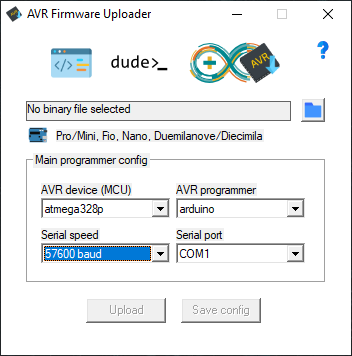

# AVR Firmware Uploader

May 14 2022 - v1.2.1

Yes, it's just a simple GUI for avrdude.

Features:
- It's obvious, but GUI
- Upload config files `.avrfw`
- Arduino board names

## List of arduino boards flashing params

`atmega328p; arduino; 57600`

- Arduino Pro or Pro Mini w/ ATmega328P
- LilyPad Arduino w/ ATmega328P
- Arduino Fio
- Arduino Nano w/ ATmega328P (old bootloader)
- Arduino Duemilanove or Diecimila w/ ATmega328P

`atmega328p; arduino; 115200`

- Arduino Mini w/ ATmega328P
- Arduino Nano w/ ATmega328P
- Arduino Ethernet
- Arduino Uno
- Arduino Uno WiFi

`atmega328p; arduino; 19200`

- Arduino BT w/ ATmega328P

`atmega168; arduino; 19200`

- Arduino Duemilanove or Diecimila w/ ATmega168
- Arduino Nano w/ ATmega168
- Arduino Mini w/ ATmega168
- Arduino BT w/ ATmega168
- LilyPad Arduino w/ ATmega168
- Arduino Pro or Pro Mini w/ ATmega168
- Arduino NG or older w/ ATmega168

`atmega32u4; avr109; 57600`

- Arduino Yún
- Arduino Yún Mini
- Arduino Micro
- Arduino Leonardo
- Arduino Leonardo ETH
- Adafruit Circuit Playground 32u4 w/ Caterina Configuration
- Arduino Industrial 101
- Linino One
- Arduino Robot Motor
- Arduino Robot Control
- LilyPad Arduino USB
- Arduino Esplora

`atmega2560; wiring; 115200`

- Arduino Mega w/ ATmega2560
- Arduino Mega ADK

`atmega1280; arduino; 57600`

- Arduino Mega w/ ATmega1280

`atmegang; arduino; 19200`

- Arduino NG or older

`atmega8; arduino; 19200`

- Arduino NG or older w/ ATmega8

`attiny85; ???; 19200`

- Arduino Gemma

---

### This package includes next open-source binaries:

 - avrdude 6.3.0

[📦 Download app (exe file)](build-win32/uploader-1.2.1.zip)

[📦 Download avrdude.exe](build-win32/avrdude-6.3.zip)

